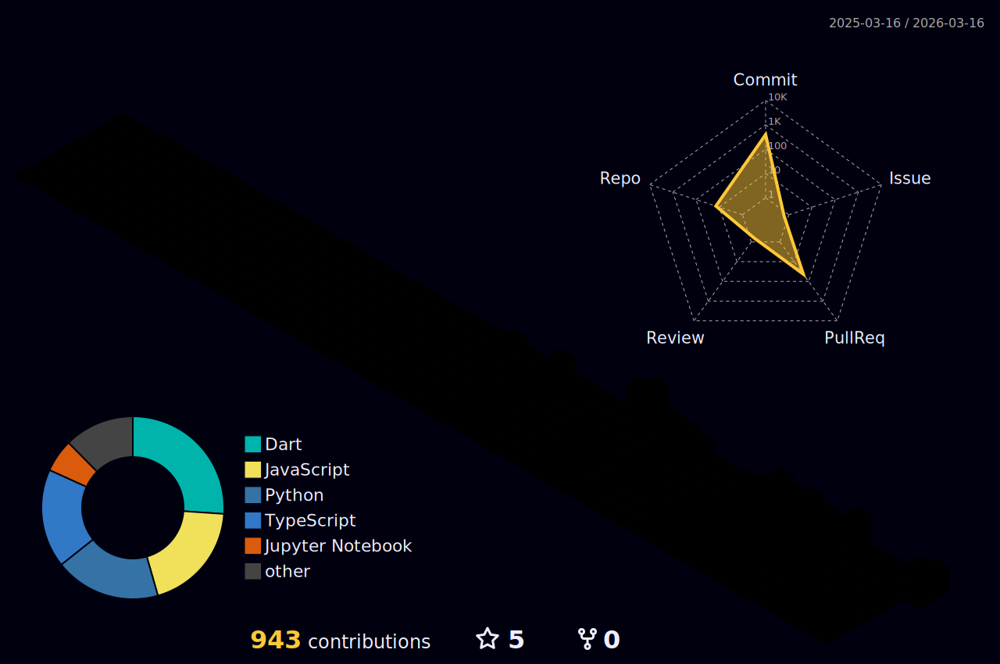

# Hey 👋 What's Up?

## I'm Raj Parihar — a Passionate Flutter App Developer from Mumbai 🚀

---

<!-- 

  

 -->

  
  
  
  

---

### 🧠 About Me

- 👨‍💻 All my projects are showcased at [**My Portfolio**](https://rajportfolio-red.vercel.app/)
- 💬 Ask me about **App Development, Flutter, Dart, Firebase, UI/UX, and Automation Tools**
- 📫 Reach me at **mrrajparihar281@gmail.com**
- ⚡ Fun fact — I debug faster with **coffee ☕ and chill background music 🎧**

---

### 🛠️ Languages & Tools

  

---

### 🏆 Achievements & Stats

  

  
  

  

---

### 💛 Support My Work

  

---

### 👾 Contribution Graph

  

---

### 🎨 3D Contribution Calendar

---

  <i>"Building seamless digital experiences, one app at a time."</i> 🚀

